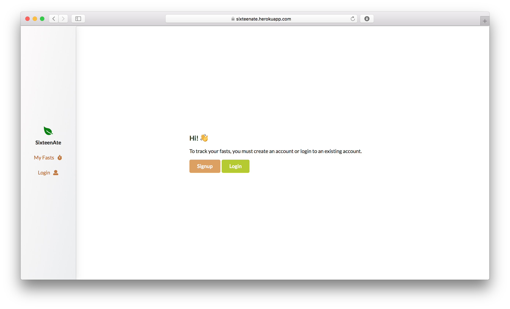

# SixteenAte: Intermittent Fasting Tracker
A MERN web application that allows users to track and manage their fasts.

### Built With
* [**React**](https://reactjs.org) - Frontend
* [**Node.js**](https://nodejs.org/en/) - Backend
* [Express.js](https://expressjs.com) - Node.js framework
* [MongoDB](http://mongodb.com) - Database
* [Passport](http://www.passportjs.org) - Authentication
* [Semantic UI](https://semantic-ui.com) - UI framework

## Demo

This application is currently deployed on Heroku at https://sixteenate.herokuapp.com.

In order to manage your fasts, you must create an account. For testing purposes, you may use the following sample credentials: username: `guest` & password: `pass123`.

## License
Released under the MIT License. See `LICENSE` for more information.

## Acknowledgments
* [react-moment](https://www.npmjs.com/package/react-moment)
* [react-datetime-picker](https://www.npmjs.com/package/react-datetime-picker)
* [passport-local-mongoose](https://www.npmjs.com/package/passport-local-mongoose)
